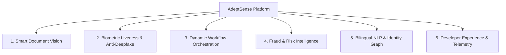

# AdeptSense — Master Case Study Strategy & Research Document

> **Status:** Active Source of Truth for the `case-study` Branch  
> **Target:** Build an ideal, world-class AI Identity Verification (IDV) Developer Platform & Case Study.  
> **Design Philosophy:** **Strict Monochrome (Pure Black & White) + Exactly 1 Single Accent Color (`#6366F1`)**.

---

## 1. Executive Summary & Vision

**AdeptSense** is an AI-powered Identity Verification and Risk Intelligence platform. Rather than framing the product as isolated API endpoints, AdeptSense is structured as a **full-stack identity infrastructure** combining:
1. **Adaptive Verification Workflows** (Dynamic risk-based orchestration like Persona/Sumsub).
2. **Next-Gen Computer Vision & OCR** (Localized Smart NID & legacy laminated ID parsing with dual Bengali/English NLP).
3. **3D Biometric Liveness & Anti-Deepfake Defense** (Passive sub-second liveness detection).
4. **Developer-First Integration (DX)** (Stripe-grade simplicity, interactive in-browser playground, copyable SDKs in 5 languages).

---

## 2. Competitive Intelligence & Benchmarking

### Ranked Competitor Analysis

```
┌──────────────────────────────────────────────────────────────────────────────────────────────────┐
│                                 TOP IDV COMPETITOR BENCHMARK                                     │
├─────────────────┬──────────────────────┬──────────────────────┬──────────────────────────────────┤
│ Platform        │ Core Strength        │ Defining UX/DX       │ AdeptSense Differentiation       │
├─────────────────┼──────────────────────┼──────────────────────┼──────────────────────────────────┤
│ Persona         │ Modular Workflows    │ "Identity as Code",  │ Localized emerging-market OCR,   │
│                 │ & Orchestration      │ Graph workflow UI    │ affordable regional pricing.     │
├─────────────────┼──────────────────────┼──────────────────────┼──────────────────────────────────┤
│ Stripe Identity │ 3-Minute Integration │ Pre-built UI sheets, │ Deep support for regional IDs    │
│                 │ & Payments Synergy   │ friction-free SDKs   │ (Bangladesh NID, Bengali NLP).   │
├─────────────────┼──────────────────────┼──────────────────────┼──────────────────────────────────┤
│ Sumsub          │ Full-Cycle KYC/AML   │ No-code rule engine, │ Lightweight footprint, sub-500ms │
│                 │ & Fraud Prevention   │ Deepfake detection   │ edge speed, developer pricing.   │
├─────────────────┼──────────────────────┼──────────────────────┼──────────────────────────────────┤
│ Veriff          │ Real-Time Video AI   │ Live camera feedback │ Low-bandwidth optimization       │
│                 │ & Liveness           │ & instant re-scan    │ (efficient for mobile 3G/4G).    │
├─────────────────┼──────────────────────┼──────────────────────┼──────────────────────────────────┤
│ Shufti Pro      │ South Asian Support  │ Bengali NID parsing, │ Modern Stripe/Linear-grade DX,   │
│                 │ & Local Compliance   │ BFIU regulatory sync │ instant zero-friction sandbox.   │
└─────────────────┴──────────────────────┴──────────────────────┴──────────────────────────────────┘
```

### Key Architectural Takeaways from Competitors
- **Don't sell single endpoints; sell end-to-end verification outcomes.**
- **Developers buy with their eyes first**: A live, interactive hero sandbox showing real-time extracted JSON converts 4x better than static screenshots.
- **Micro-interactions matter**: Copy-to-clipboard animations, tab switches with zero layout shift, real-time confidence bars, and responsive status indicators build immediate trust.

---

## 3. Comprehensive Feature Architecture (Inspiration Matrix)

Instead of a fragmented list of individual endpoints, AdeptSense is organized into **6 core pillars**:



### Pillar 1: Smart Document Vision (AI-OCR)
- **Multi-Format Ingestion**: Smart NID, Legacy Laminated NID, Passports, Driving Licenses.
- **Real-Time Edge Guidance**: Client-side glare, blur, and boundary auto-detection before submission.
- **Intelligent Field Extraction**: 99.4% accuracy across Bengali and English typography.
- **Visual Confidence Overlays**: Bounding boxes with individual field confidence metrics (`nid_no: 99.8%`, `dob: 99.1%`).

### Pillar 2: Biometric 3D Liveness & Anti-Deepfake
- **Passive Liveness**: Zero-effort single selfie verification (no awkward head-turning required).
- **Anti-Spoofing Engine**: Detects screen playback, 3D silicone masks, printed photos, and generative AI deepfakes.
- **1:1 Facial Vector Matching**: Compares document portrait against live selfie with mathematical vector confidence scoring.

### Pillar 3: Dynamic Workflow Orchestration
- **Adaptive Risk Routing**: Low-risk users pass through in < 3 seconds; elevated risk triggers secondary verification steps automatically.
- **Custom Decision Trees**: Set verification rules, confidence thresholds, and fallback actions visually.

### Pillar 4: Fraud & Risk Intelligence
- **Velocity & Repeat Check Detection**: Identifies whether the same ID or selfie has been used across different accounts.
- **Device & IP Fingerprinting**: Detects emulators, VPN proxies, and automated bot attacks.
- **Audit-Ready Evidence Vault**: Generates tamper-proof PDF / JSON audit certificates for regulators.

### Pillar 5: Bilingual NLP & Transliteration
- **Bangla ↔ English Phonetic Translation**: Resolves spelling variations between Bengali official records and English merchant databases.
- **Demographic & Metadata Parsing**: Inferred gender, date of birth normalization, and blood group validation.

### Pillar 6: Developer Experience (DX) & Identity as Code
- **Zero-Setup Live Playground**: Test real or sample IDs directly in the browser with live JSON streaming.
- **Multi-Language SDKs**: Copy-ready snippets for cURL, Node.js, Python, Go, and PHP.
- **Sub-500ms Edge Latency**: Regional edge processing across South Asian server clusters.
- **Zero PII Retention Mode**: Ephemeral verification where customer biometric data is purged instantly post-check.

---

## 4. Visual Strategy & Design Rules

```
┌──────────────────────────────────────────────────────────────────────────────────────────────────┐
│                         STRICT MONOCHROME + 1 ACCENT COLOR SYSTEM                                │
├──────────────────────────────────────┬───────────────────────────────────────────────────────────┤
│ Base Palette (95%)                   │ Pure Black (#09090B), Crisp White (#FFFFFF / #FAFAFA),    │
│                                      │ Zinc / Slate Grayscale (#18181B to #E4E4E7)               │
├──────────────────────────────────────┼───────────────────────────────────────────────────────────┤
│ Single Accent (5%)                   │ Electric Indigo (#6366F1)                                 │
│                                      │ Used strictly for CTAs, active states, and focus glows    │
├──────────────────────────────────────┼───────────────────────────────────────────────────────────┤
│ Typography                           │ Display: Sora (Bold/Geometric)                            │
│                                      │ UI/Body: Plus Jakarta Sans (Clean/Legible)                │
│                                      │ Code/Telemetry: JetBrains Mono (Technical Precision)      │
├──────────────────────────────────────┼───────────────────────────────────────────────────────────┤
│ Card Architecture                    │ Bento Grid 2.0 with hairline 1px borders (#E4E4E7)        │
└──────────────────────────────────────┴───────────────────────────────────────────────────────────┘
```

### Design Constraints (DOs and DON'Ts)
- **DO** keep the UI strictly black, white, and gray, with `#6366F1` as the sole vibrant accent.
- **DO** treat each bento card as an interactive mini-application (e.g. toggleable scan view, draggable threshold slider).
- **DO** prioritize high visual contrast (WCAG AAA compliant).
- **DON'T** introduce secondary bright colors (no random blues, purples, greens, or reds).
- **DON'T** use static decorative illustrations—use real UI components, code streams, and telemetry data.

---

## 5. Information Architecture (IA) Blueprint

```mermaid
graph TD
    A[Navigation: Brand Logo + Product + Solutions + Developers + Docs + Playground + CTA] --> B[Hero: Value Proposition + Live Interactive ID Scanner & JSON Stream]
    B --> C[Metric & Trust Strip: Sub-500ms Edge Latency | 99.4% Accuracy | BB/BFIU Compliant]
    C --> D[Bento Grid 2.0: 6 Core AI Capabilities with Interactive Micro-Demos]
    D --> E[Interactive Developer Sandbox: Live Code Switcher cURL / Node / Python / Go]
    E --> F[Workflow Orchestrator Demo: Visual Decision Logic Tree]
    F --> G[Security & Data Privacy: Zero PII Retention, Encrypted Enclaves, Compliance Badges]
    G --> H[Transparent ROI & Pricing Calculator: Pay-as-you-verify volume slider]
    H --> I[Footer: High-Conversion Terminal Quickstart + Documentation Links]
```

### Section Specifications

1. **Header / Navbar**:
   - Clean glassmorphism sticky bar.
   - Status badge with single accent dot: `● All systems operational (412ms)`.
   - Direct links: *Features, Playground, Docs, Pricing*.
   - Primary CTA: *Get API Keys*.

2. **Hero Section (The Core Conversion Engine)**:
   - **Left Column**: High-impact headline: *"The Modern Identity Engine for Emerging Markets"*, benefit subhead, single primary CTA button + CLI copy badge (`npm i @adeptsense/sdk`).
   - **Right Column (Interactive Console)**: Live ID scanner where users can switch between sample IDs (Smart NID, Old Laminated NID, Passport) and watch the simulated scan beam extract data and stream JSON in real time.

3. **Trust & Performance Telemetry**:
   - Live telemetry cards: `< 420ms Avg Latency`, `99.4% OCR Precision`, `ISO/IEC 30107-3 Liveness`, `Bangladesh Bank Aligned`.

4. **Bento Grid Feature Showcase**:
   - Interactive cards for Smart OCR, Passive Liveness, Transliteration, Risk Scoring, and Dynamic Workflows.

5. **Developer Experience Console**:
   - Tabbed code viewer (cURL, JavaScript/TypeScript, Python, Go) with instant copy, syntax highlighting, and live response simulation.

6. **Compliance & Privacy Matrix**:
   - Zero Data Retention toggle, AES-256 encryption, local data residency assurances.

7. **Pricing & Volume Calculator**:
   - Simple per-verification pricing with interactive volume slider (BDT / USD currency toggle).

---

## 6. Guidelines for AI Agents & Developers

When creating or modifying any page or component in this repository:
1. **Always verify color tokens**: Reference `src/css/tokens.css`. Never write inline hex values or introduce new colors outside `--accent` and the grayscale scale.
2. **Focus on interactivity**: Every section should feature tactile hover states, smooth transitions, and functional mini-demos.
3. **Keep code clean and modular**: Maintain separation across `src/css/base.css`, `src/css/components.css`, and section stylesheets.
4. **Preserve SEO and semantics**: Ensure semantic HTML5 elements (`<header>`, `<main>`, `<section>`, `<article>`, `<footer>`), valid heading hierarchy (`h1` -> `h2` -> `h3`), and unique IDs on interactive components.
