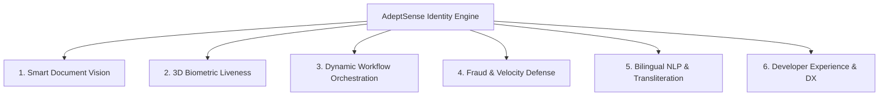

# Step 02: Define & Strategize (Synthesize)

> **UX Design Phase:** 02 — Synthesize & Scope  
> **Document Status:** Master Reference for Step 2  
> **Context:** Product Definition, Personas, 6-Pillar Architecture & Design Tokens (AdeptSense Case Study)

---

## 1. User Personas & Jobs-to-be-Done (JTBD)

To create a conversion-optimized and developer-beloved platform, we define two primary user personas:

```
┌──────────────────────────────────────────────┬──────────────────────────────────────────────┐
│  PERSONA 1: THE LEAD SOFTWARE ENGINEER       │  PERSONA 2: HEAD OF RISK & PRODUCT           │
├──────────────────────────────────────────────┼──────────────────────────────────────────────┤
│ Name: "Arif" — Staff Backend / Full-Stack    │ Name: "Nadia" — VP Product / Fintech Lead    │
│ Goal: Integrate KYC/IDV in under 1 day       │ Goal: Maximize conversion, prevent fraud     │
│ Frustrations: Rigid SDKs, bad error docs,    │ Frustrations: High drop-off, foreign pricing │
│ slow API response times, complex auth.       │ in USD, non-compliance with Bangladesh Bank.│
│                                              │                                              │
│ JTBD: "When I integrate ID verification,     │ JTBD: "When our users sign up, I want them   │
│ I want instant copyable SDKs and clear       │ verified in < 5 seconds with zero fraud, so  │
│ JSON responses, so I can ship on time."      │ our business scales compliantly."            │
└──────────────────────────────────────────────┴──────────────────────────────────────────────┘
```

---

## 2. Problem Statements & "How Might We" (HMW)

Based on our discovery research, we synthesize three core HMW challenges:

1. **HMW (Developer Experience):** How might we allow an engineer to test live identity verification on real sample documents and see JSON telemetry within **3 seconds of landing on the page**?
2. **HMW (Conversion & Accuracy):** How might we achieve **sub-500ms latency and 99.4% accuracy** across diverse document conditions (laminated cards, glares, non-Latin Bengali ligatures)?
3. **HMW (Trust & Architecture):** How might we present a unified **6-pillar full-stack identity engine** rather than a fragmented list of disconnected API endpoints?

---

## 3. The 6-Pillar Feature Architecture

Instead of isolated endpoints, AdeptSense is structured around **6 holistic product pillars**:



### Pillar Breakdown
1. **Smart Document Vision (AI-OCR):**
   - Ingests Smart NID, Legacy Laminated NID, Passports, and Driving Licenses.
   - Client-side real-time edge bounding, blur detection, and auto-cropping.
   - Field-level confidence scores (`nid_number: 99.8%`, `dob: 99.1%`).
2. **3D Biometric Liveness & Anti-Deepfake:**
   - Passive single-selfie verification (zero head-movement required).
   - Generative AI deepfake, silicone mask, and screen replay defense.
   - 1:1 facial vector matching against document portrait.
3. **Dynamic Workflow Orchestration:**
   - Low-risk users pass through in < 3s; elevated risk dynamically triggers step-up verification.
   - Visual decision logic trees and customizable confidence thresholds.
4. **Fraud & Velocity Defense:**
   - Detects repeated ID usage across different accounts (device & IP fingerprinting).
   - Generates tamper-proof audit certificates for regulatory compliance.
5. **Bilingual NLP & Transliteration:**
   - Automatic phonetic mapping between Bengali (বাংলা) and English characters.
   - Demographic inference (gender, DOB normalization, blood group).
6. **Developer Experience (DX) & Identity as Code:**
   - In-browser interactive sandbox with zero setup.
   - Copyable SDK snippets for cURL, Node.js, Python, Go, and PHP.
   - Zero PII retention mode (ephemeral processing with instant biometric purge).

---

## 4. Visual Strategy & Design Token System

To create an ultra-modern, high-contrast, developer-first aesthetic (Linear / Vercel / Persona benchmark), the visual design follows a **Strict Monochrome + 1 Single Accent Color** rule.

```
┌──────────────────────────────────────────────────────────────────────────────────────────────────┐
│                         STRICT MONOCHROME + 1 ACCENT COLOR SYSTEM                                │
├──────────────────────────────────────┬───────────────────────────────────────────────────────────┤
│ Grayscale Canvas (95%)               │ Pitch Ink (#09090B), Charcoal (#18181B),                  │
│                                      │ Zinc Grays (#52525B to #E4E4E7), Crisp White (#FFFFFF)   │
├──────────────────────────────────────┼───────────────────────────────────────────────────────────┤
│ Single Accent (5%)                   │ Electric Indigo (#6366F1)                                 │
│                                      │ (CTAs, active tabs, focus rings, telemetry pulse)         │
├──────────────────────────────────────┼───────────────────────────────────────────────────────────┤
│ Typography Hierarchy                 │ Display: Sora (Geometric, Bold)                           │
│                                      │ UI/Body: Plus Jakarta Sans (Clean, Legible)               │
│                                      │ Code: JetBrains Mono (Technical Precision)                │
├──────────────────────────────────────┼───────────────────────────────────────────────────────────┤
│ Layout Architecture                  │ Bento Grid 2.0 with hairline 1px borders (#E4E4E7)        │
└──────────────────────────────────────┴───────────────────────────────────────────────────────────┘
```

### Visual Rules (The "Anti-Clutter" Guardrails)
- **Zero Multi-Color Clutter:** No mixing random blues, purples, greens, and reds on the same screen.
- **Micro-Interactions Over Static Images:** Use live code stream animations, interactive toggles, and responsive state indicators instead of flat marketing screenshots.
- **High Contrast:** All text must strictly comply with WCAG AAA contrast ratios against its background.

---

## 5. Information Architecture (IA) Blueprint

```
┌──────────────────────────────────────────────────────────────────────────────────────────────────┐
│                              PAGE BLUEPRINT: index.html (LANDING PAGE)                           │
├──────────────────────────────────────────────────────────────────────────────────────────────────┤
│ 1. STICKY NAVBAR    │ Brand Logo · Product · Playground · Docs · Pricing · [Get API Keys]        │
├─────────────────────┼────────────────────────────────────────────────────────────────────────────┤
│ 2. HERO CONSOLE     │ Left: Value proposition + CLI copy badge (`npm i @adeptsense/sdk`)         │
│                     │ Right: Live Interactive ID Scanner + Real-time Streaming JSON Telemetry     │
├─────────────────────┼────────────────────────────────────────────────────────────────────────────┤
│ 3. TELEMETRY STRIP  │ Live Stats: < 420ms Latency · 99.4% Precision · BB/BFIU Compliant          │
├─────────────────────┼────────────────────────────────────────────────────────────────────────────┤
│ 4. BENTO GRID 2.0   │ 6 Core AI Capability Cards with interactive micro-demos                    │
├─────────────────────┼────────────────────────────────────────────────────────────────────────────┤
│ 5. DEVELOPER SUITE  │ Multi-language code tabs (cURL, Node, Python, Go) + Live Webhook Inspector │
├─────────────────────┼────────────────────────────────────────────────────────────────────────────┤
│ 6. COMPLIANCE & SEC │ Zero PII Retention toggle · Data Residency · Audit Vault Certificate       │
├─────────────────────┼────────────────────────────────────────────────────────────────────────────┤
│ 7. ROI CALCULATOR   │ Interactive Volume Slider (BDT / USD currency switch)                      │
├─────────────────────┼────────────────────────────────────────────────────────────────────────────┤
│ 8. CONVERSION FOOTER│ Terminal Quickstart + Docs Directory + System Status Indicator             │
└──────────────────────────────────────────────────────────────────────────────────────────────────┘
```

---

## 6. Synthesis Summary & Next Action

With Step 1 (Research & Discovery) and Step 2 (Definition & Strategy) fully locked in:
- The problem is crystal clear.
- The 6-pillar architecture replaces all legacy endpoint concepts.
- The single-accent monochrome design system is codified.

We proceed directly to **Step 3 (Ideation / Wireframes)** and **Step 4 (High-Fidelity UI Implementation)** on `index.html`.
