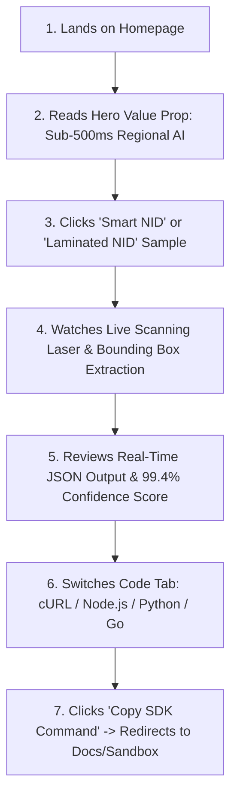
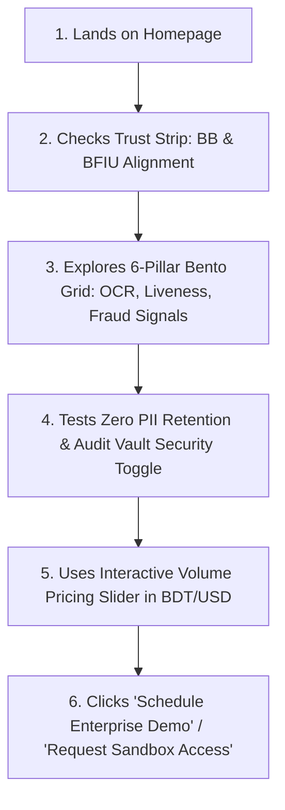

# Step 03: Ideate & Architect (Structure & Wireframes)

> **UX Design Phase:** 03 — Ideate & Architect  
> **Document Status:** Master Reference for Step 3  
> **Context:** User Flows, Wireframe Schemas, State Machines & Component Blueprints (AdeptSense Case Study)

---

## 1. User Journey & Conversion Flows

To guarantee maximum engagement and minimum friction, we map out the **Developer Conversion Journey** and the **Fintech Risk Officer Evaluation Flow**.

### Flow A: The Developer Fast-Path (< 60 Seconds to Conversion)



### Flow B: The Fintech Compliance & Risk Officer Evaluation



---

## 2. Low/Mid-Fidelity Wireframe Schemas

### Section 1: Sticky Navigation Bar
```
┌──────────────────────────────────────────────────────────────────────────────────────────────────┐
│ [●] ADEPT-SENSE    Platform ▾    Solutions ▾    Playground    Docs    Pricing    [Get API Keys]  │
└──────────────────────────────────────────────────────────────────────────────────────────────────┘
```
- **Sticky Glassmorphic Container:** Frosted backdrop filter (`backdrop-filter: blur(12px)`), hairline bottom border (`#E4E4E7`).
- **Telemetry Pill:** Small monochrome pill with single electric accent dot: `● All systems 412ms`.
- **Primary Action:** Solid monochrome/accent CTA `Get API Keys`.

---

### Section 2: Hero Section (The Core Conversion Engine)
```
┌──────────────────────────────────────────────────────────────────────────────────────────────────┐
│                                                                                                  │
│  [●] THE MODERN IDENTITY ENGINE                                                                  │
│  Instant AI Verification for                    ┌──────────────────────────────────────────────┐ │
│  Emerging Markets.                              │ [Smart NID]  [Laminated NID]  [e-Passport]   │ │
│                                                 ├──────────────────────┬───────────────────────┤ │
│  Automate KYC, verify Bengali and English       │                      │  RESPONSE TELEMETRY   │ │
│  documents, and prevent deepfakes with          │   [ DOCUMENT VIEW ]  │  Status: 200 OK       │ │
│  sub-500ms edge precision.                      │   ┌────────────────┐ │  Latency: 382ms       │ │
│                                                 │   │ ══════════════ │ │  Confidence: 99.8%    │ │
│  ┌──────────────────┐  ┌──────────────────┐     │   │ [LASER BEAM]   │ │                       │ │
│  │ Get API Keys →   │  │ Try Sandbox      │     │   │                │ │  {                    │ │
│  └──────────────────┘  └──────────────────┘     │   │ [Bounding Box] │ │    "name": "...",     │ │
│                                                 │   │ "Name: Rahim"  │ │    "nid": "...",      │ │
│  $ npm i @adeptsense/sdk           [COPY]       │   └────────────────┘ │    "liveness": true   │ │
│                                                 │                      │  }                    │ │
│                                                 └──────────────────────┴───────────────────────┘ │
│                                                                                                  │
└──────────────────────────────────────────────────────────────────────────────────────────────────┘
```

---

### Section 3: Performance Telemetry & Trust Strip
```
┌──────────────────────────────────────────────────────────────────────────────────────────────────┐
│  < 420ms Avg Latency  │  99.4% OCR Precision  │  ISO/IEC 30107 Liveness  │  BB & BFIU Compliant  │
└──────────────────────────────────────────────────────────────────────────────────────────────────┘
```
- **4 Equal Metric Tiles:** Large display numbers (`32px Sora font-weight: 700`) + secondary explanation labels.
- **Hairline dividers:** Clean 1px `#E4E4E7` borders between stats.

---

### Section 4: Bento Grid 2.0 (The 6 Product Pillars)
```
┌──────────────────────────────────────────────────────────────────────────────────────────────────┐
│  BENTO GRID ARCHITECTURE (2x3 Modular Layout)                                                    │
│                                                                                                  │
│  ┌──────────────────────────────────────────────┐  ┌──────────────────────────────────────────┐  │
│  │ 1. SMART DOCUMENT VISION (AI-OCR) [2x1]      │  │ 2. 3D BIOMETRIC LIVENESS [1x1]           │  │
│  │ Interactive dual-card scan: Smart NID vs     │  │ Passive single-selfie depth verification.│  │
│  │ Old Laminated NID with glare filter.         │  │ Anti-deepfake & silicone mask shield.    │  │
│  │ [Interactive Toggle: Smart / Laminated]      │  │ [3D Mesh Wireframe Visualization]        │  │
│  ├──────────────────────────────────────────────┤  ├──────────────────────────────────────────┤  │
│  │ 3. DYNAMIC WORKFLOW ORCHESTRATOR [1x1]       │  │ 4. FRAUD & VELOCITY DEFENSE [1x1]        │  │
│  │ Adaptive risk routing logic tree: Low risk   │  │ Cross-merchant repeat ID detection and   │  │
│  │ passes in < 3s, high risk triggers step-up.  │  │ device fingerprint telemetry.            │  │
│  │ [Visual Decision Graph Nodes]                │  │ [Live Velocity Anomaly Gauge]            │  │
│  ├──────────────────────────────────────────────┴──┴──────────────────────────────────────────┤  │
│  │ 5. BILINGUAL NLP & TRANSLITERATION GRAPH [1x1]  │ 6. DEVELOPER EXPERIENCE (DX) [1x1]       │  │
│  │ Real-time phonetic mapper (বাংলা ↔ English)  │ Zero-setup sandboxes, copy-paste SDKs,   │  │
│  │ with fuzzy spelling reconciliation.          │ and instant webhook event simulators.    │  │
│  └─────────────────────────────────────────────────┴──────────────────────────────────────────┘  │
└──────────────────────────────────────────────────────────────────────────────────────────────────┘
```

---

### Section 5: Developer Suite & Interactive Code Switcher
```
┌──────────────────────────────────────────────────────────────────────────────────────────────────┐
│  DEVELOPER-FIRST INTEGRATION                                                                     │
│  Drop in 3 lines of code. Support for all modern backend runtimes.                               │
│                                                                                                  │
│  ┌────────────────────────────────────────────────────────────────────────────────────────────┐  │
│  │ [cURL]  [Node.js / TypeScript]  [Python]  [Go]  [PHP]                        [COPY CODE]   │  │
│  ├────────────────────────────────────────────────────────────────────────────────────────────┤  │
│  │ 1  import { AdeptSense } from '@adeptsense/sdk';                                           │  │
│  │ 2                                                                                          │  │
│  │ 3  const client = new AdeptSense({ apiKey: process.env.ADEPTSENSE_KEY });                   │  │
│  │ 4  const verification = await client.identity.verify({                                     │  │
│  │ 5    document: './nid-front.jpg',                                                          │  │
│  │ 6    selfie: './user-selfie.jpg',                                                          │  │
│  │ 7    workflow: 'fintech_fast_pass'                                                         │  │
│  │ 8  });                                                                                     │  │
│  │ 9  console.log(verification.status, verification.confidence); // "VERIFIED", 0.998         │  │
│  └────────────────────────────────────────────────────────────────────────────────────────────┘  │
└──────────────────────────────────────────────────────────────────────────────────────────────────┘
```

---

### Section 6: Security, Privacy & Compliance Architecture
```
┌──────────────────────────────────────────────────────────────────────────────────────────────────┐
│  ENTERPRISE SECURITY & DATA RESIDENCY                                                            │
│                                                                                                  │
│  ┌───────────────────────────┐  ┌───────────────────────────┐  ┌──────────────────────────────┐  │
│  │ ZERO PII RETENTION        │  │ ENCRYPTED ENCLAVES        │  │ AUDIT EVIDENCE VAULT         │  │
│  │ Ephemeral processing:     │  │ AES-256 at rest,          │  │ Tamper-proof JSON/PDF        │  │
│  │ biometrics purged post-   │  │ TLS 1.3 in transit with   │  │ certificates for Bangladesh   │  │
│  │ check automatically.      │  │ dedicated local tenancy.  │  │ Bank regulatory audits.      │  │
│  └───────────────────────────┘  └───────────────────────────┘  └──────────────────────────────┘  │
└──────────────────────────────────────────────────────────────────────────────────────────────────┘
```

---

### Section 7: Interactive Volume & ROI Pricing Calculator
```
┌──────────────────────────────────────────────────────────────────────────────────────────────────┐
│  TRANSPARENT, USAGE-BASED PRICING                                                                │
│  Currency: [● BDT (৳)]  [  USD ($) ]                                                             │
│                                                                                                  │
│  Monthly Verification Volume:  [ 15,000 checks / month ]                                         │
│  ══════════════════════════════●═══════════════════════════════════════════ (Draggable Slider)   │
│                                                                                                  │
│  ┌──────────────────────────────────────────────┐  ┌──────────────────────────────────────────┐  │
│  │ ESTIMATED COST                               │  │ WHAT'S INCLUDED                          │  │
│  │ ৳ 4.50 / verification                        │  │ ✓ All 6 AI Capabilities Included         │  │
│  │ Total: ৳ 67,500 / month                      │  │ ✓ 99.99% Uptime SLA Guaranteed           │  │
│  │ [ Start 500 Free Verifications ]             │  │ ✓ Dedicated Regional Edge Cluster        │  │
│  └──────────────────────────────────────────────┘  └──────────────────────────────────────────┘  │
└──────────────────────────────────────────────────────────────────────────────────────────────────┘
```

---

## 3. Interaction & State Machine Logic Models

### Hero Interactive Scanner State Machine
```
   ┌───────────────┐
   │ 1. IDLE STATE │ ──▶ User clicks sample card (Smart NID / Laminated NID)
   └───────────────┘
           │
           ▼
   ┌───────────────────┐
   │ 2. SCANNING STATE │ ──▶ Laser scan line animates top-to-bottom (1.2s)
   │                   │ ──▶ Bounding box coordinates calculate dynamically
   └───────────────────┘
           │
           ▼
   ┌───────────────────┐
   │ 3. MATCHED STATE  │ ──▶ Green/Accent bounding boxes lock on Name, NID, DOB
   │                   │ ──▶ Terminal output streams formatted JSON payload
   │                   │ ──▶ Telemetry bar counts up from 0% to 99.8% match
   └───────────────────┘
```

### Code Switcher State Machine
- Tab button click changes the active language with zero DOM layout shift.
- The `Copy Code` button transitions to a checkmark state (`"Copied!"`) for 2000ms before returning to `"Copy"`.

---

## 4. High-Conversion Copywriting Architecture

| Element | Copy Strategy / Value Proposition |
| :--- | :--- |
| **Eyebrow Badge** | `● Next-Gen Identity Verification for Emerging Markets` |
| **H1 Headline** | `The Modern Identity Engine for Emerging Markets.` |
| **Hero Subhead** | `Automate KYC, verify Bengali & English IDs, and prevent deepfakes with sub-500ms edge AI precision.` |
| **Primary CTA** | `Get Free API Keys →` |
| **Secondary CTA**| `Explore Live Playground` |
| **CLI Quickstart**| `npm i @adeptsense/sdk` |

---

## 5. Architectural Summary & Ready for Step 4

With **Step 3 (Ideate & Architect)** fully specified:
1. Every section has an explicit wireframe blueprint.
2. The user conversion funnels are locked in.
3. The interactive states for the Hero Scanner and Bento Grid are defined.

We are now ready for **Step 4 (High-Fidelity UI & Component Implementation)**.
