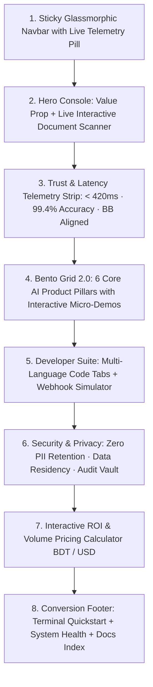

# Step 04: Design & Prototype (High-Fidelity Implementation)

> **UX Design Phase:** 04 — Design & Prototype  
> **Document Status:** Master Reference for Step 4  
> **Context:** High-Fidelity Design System, Interactive Component Blueprints, State Models & Code Implementation (AdeptSense Case Study)

---

## 1. High-Fidelity Design System Specification

The design system is strictly engineered around **Monochromatic Utility + 1 Vibrant Accent Color (`#6366F1`)**:

```
┌──────────────────────────────────────────────────────────────────────────────────────────────────┐
│                         HIGH-FIDELITY DESIGN SYSTEM TOKENS                                       │
├──────────────────────┬────────────────────────┬──────────────────────────────────────────────────┤
│ Token Category       │ Token Name & Value     │ Role & Implementation                            │
├──────────────────────┼────────────────────────┼──────────────────────────────────────────────────┤
│ Single Accent        │ `--accent: #6366F1`    │ Primary CTA button, interactive tab indicator,   │
│                      │                        │ focus ring glow, active telemetry signals        │
├──────────────────────┼────────────────────────┼──────────────────────────────────────────────────┤
│ Accent Hover/Press   │ `--accent-hover: #4F46E5`| Hover state for buttons and links             │
│                      │ `--accent-dim: ...`    │ Subtle 8% tint for badge/chip backgrounds        │
├──────────────────────┼────────────────────────┼──────────────────────────────────────────────────┤
│ Ink Hierarchy        │ `--ink: #09090B`       │ Pitch black display headings and primary text    │
│                      │ `--ink-2: #18181B`     │ Nav labels, secondary titles                     │
│                      │ `--ink-3: #52525B`     │ High-legibility body descriptions                │
│                      │ `--ink-4: #71717A`     │ Metadata, subheadings, placeholders              │
├──────────────────────┼────────────────────────┼──────────────────────────────────────────────────┤
│ Surface Elevation    │ `--bg: #FAFAFA`        │ Off-white main canvas                            │
│                      │ `--surface: #FFFFFF`   │ Card bodies, dropdown menus, modals             │
│                      │ `--surface-2: #F4F4F5` │ Sub-cards, input boxes, preview strips           │
│                      │ `--border: #E4E4E7`    │ 1px crisp hairline borders                       │
├──────────────────────┼────────────────────────┼──────────────────────────────────────────────────┤
│ Terminal Canvas      │ `--code-bg: #09090B`   │ Deep obsidian developer console                  │
│                      │ `--code-bg-2: #121215` │ Elevated terminal windows & cards                │
│                      │ `--code-line: #27272A` │ Terminal hairline border                         │
│                      │ `--code-fg: #E4E4E7`   │ Monospace text                                   │
├──────────────────────┼────────────────────────┼──────────────────────────────────────────────────┤
│ Typography           │ `Sora`                 │ Display Headings (H1, H2, Section Titles)        │
│                      │ `Plus Jakarta Sans`    │ UI, Navigation, Body Text                        │
│                      │ `JetBrains Mono`       │ Code Snippets, JSON, Telemetry, CLI              │
└──────────────────────┴────────────────────────┴──────────────────────────────────────────────────┘
```

---

## 2. Interactive Component Specifications

### 1. Live Hero Document Scanner & Telemetry Engine
- **Left Panel (Document Viewport):**
  - Displays document preview (Smart NID, Laminated NID, or Passport).
  - Vertical laser beam (`animation: scanBeam 1.8s ease-in-out infinite alternate`).
  - Active bounding boxes with field tooltips (Name, NID No, DOB, Photo Match).
- **Right Panel (Streaming JSON Inspector):**
  - Formatted JSON response with live syntax coloring.
  - Telemetry status pill (`200 OK | 382ms | Match: 99.8%`).
  - Dynamic sample selector tabs (`Smart NID`, `Laminated NID`, `Passport`).

### 2. The 6-Pillar Bento Grid 2.0
- **Pillar 1 (Smart Document Vision):** Interactive sample card comparison (Smart vs Laminated) with glare reduction toggle.
- **Pillar 2 (3D Biometric Liveness):** Animated facial depth mesh wireframe demonstrating anti-deepfake presentation attack detection.
- **Pillar 3 (Dynamic Workflow Orchestration):** Interactive decision tree with customizable risk thresholds.
- **Pillar 4 (Fraud & Velocity Defense):** Cross-merchant repeat ID detector with simulated velocity anomaly badge.
- **Pillar 5 (Bilingual NLP Engine):** Live phonetic mapper demonstrating Bengali (`বাংলা`) ↔ English transliteration resolution.
- **Pillar 6 (Developer Experience):** Instant sandbox launcher and 1-click CLI installer.

### 3. Multi-Language Developer Suite
- Dynamic tab switcher supporting **cURL**, **Node.js/TypeScript**, **Python**, **Go**, and **PHP**.
- 1-Click copy with tactile visual feedback (`"Copy Code"` → `"✓ Copied to Clipboard"`).
- Webhook simulation panel showing real-time event payloads.

### 4. Interactive ROI & Volume Calculator
- Draggable range slider from 1,000 to 250,000 monthly verifications.
- Currency toggle: **BDT (৳)** and **USD ($)**.
- Real-time unit rate and total monthly cost computation with automatic volume tier discounts.

---

## 3. High-Fidelity Page Architecture (`index.html`)



---

## 4. Implementation Checklist

- [x] Update `src/css/tokens.css` with single accent and monochrome scale.
- [x] Refactor `src/css/base.css` and typography declarations for `Sora`, `Plus Jakarta Sans`, and `JetBrains Mono`.
- [x] Build out high-fidelity components in `src/css/components.css` and section stylesheets.
- [x] Update `index.html` with complete semantic structure, interactive scanner markup, bento grid, developer suite, and ROI calculator.
- [x] Wire up interactive state machines in `src/main.js`.
- [x] Verify zero build errors with `npx vite build`.
